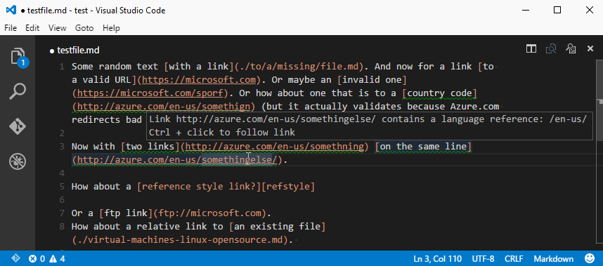
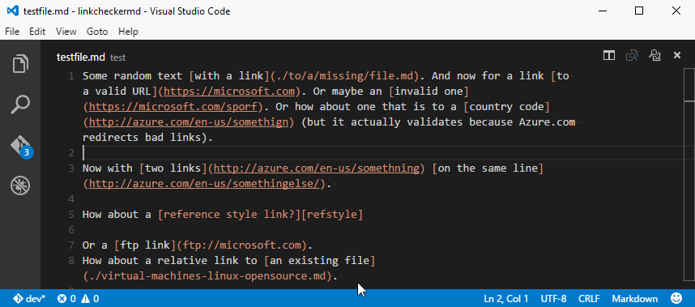

#Functionality
Load a Markdown file and get highlights and hovers for links that contain a country code (en-us for example.) 

If you use Alt+L, it will generate a report on the links in the document, including broken links. It attempts to check broken links by trying to resolve HTTP & HTTPS links, and relative links (../folder/file.md) by checking if the file exist on the local file system. The result of these checks are logged in an output window on the right of the editor.

Note that checking for broken links is more of an art than a science. Some sites don't actually return 404, but send you to a landing page. For example, Azure.com works this way. You can go to https://Azure.com/foo/bar and it will happily redirect you to https://Azure.com, with no 404 status returned. So take a status of "OK" with a grain of salt - you may not be arriving at the page you intend.

##Install

Open Visual Studio Code and press `F1`; a field will appear at the top of the window. Type `ext install linkcheck`, hit enter, and reload the window to enable.

##Check for country code

Checking for country codes in links happens as you type, and will underline links with green.

##Check for broken links

To check for broken links, use Alt+L. This will open a new column to the right of the VSCode window and display the status of the links as they are checked.

##Changes

###0.1.5

- Added country code warnings to the output window for Alt+L checking
- Updated vscode dependency for the latest version

##TODO

* Refactor broken link checking to display the actual URL that you arrived at for "OK" results that were redirects to a different URL.

